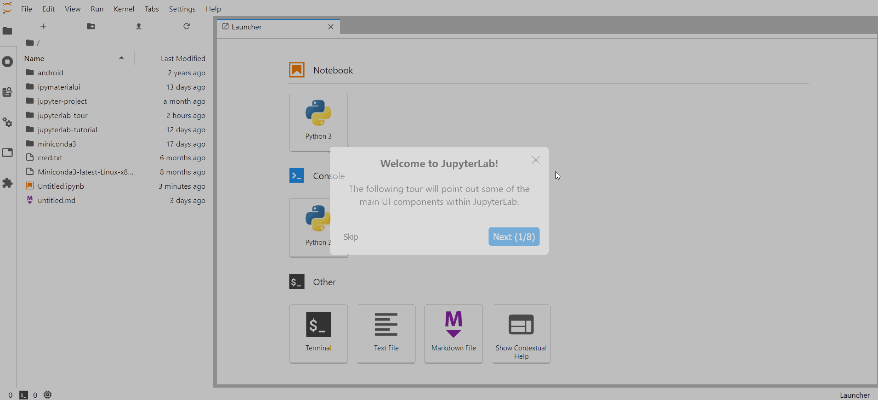

# jupyterlab-tour

[](https://mybinder.org/v2/gh/fcollonval/jupyterlab-tour/master?urlpath=lab)



A JupyterLab UI Tour based on [jupyterlab-tutorial](https://github.com/CDAT/jupyterlab-tutorial) and [react-joyride](https://docs.react-joyride.com).

Compare to `jupyterlab-tutorial`, this extension add the following features:

- Add default tours:
  - Welcome tour
  - Notebook tour
- If a tour has already be seen by the user, this is saved in the state database. So you can start tour on event only if the user have not seen it; e.g. the welcome tour is launched at JupyterLab start except if the user have seen it.

> The state is cleaned if this extension is updated

- Tooltip are styled using JupyterLab theming system
- Clear separation between tour manager and React views
- Add commands to _add_ and _launch_ tours

And it keeps the nice features:

- Through the tour manager (`ITutorialManager` extension token), you can add, modify or delete a tour
- You can connect to tour events through signals
- You can override the default style for the tour separately.

## Requirements

- JupyterLab >= 2.0

## Install

```bash
jupyter labextension install jupyterlab-tour
```

## How to add tour for my JupyterLab extension

There are two methods to add a tour: the easiest is to use JupyterLab commands and the advanced version is to request this
extension token `ITutorialManager`.

### Add easily a tour

```ts
const { commands } = app;

// Add a tour - returns the tour or null if something went wrong
const tour = (await app.commands.execute('jupyterlab-tour:add', {
  tour: { // Tour must be of type ITour - see src/interfaces.ts
    id: 'test-jupyterlab-tour:welcome',
    label: 'Welcome Tour',    
    hasHelpEntry: true,
    steps: [  // Step must be of type IStep - see src/interfaces.ts
      {
        content:
          'The following tutorial will point out some of the main UI components within JupyterLab.',
        placement: 'center',
        target: '#jp-main-dock-panel',
        title: 'Welcome to Jupyter Lab!'
      },
      {
        content:
          'This is the main content area where notebooks and other content can be viewed and edited.',
        placement: 'left-end',
        target: '#jp-main-dock-panel',
        title: 'Main Content'
      }
    ]
  }
})) as ITutorial;

if ( tour ) {
  app.commands.execute('jupyterlab-tour:launch', {
    id: 'test-jupyterlab-tour:welcome',
    force: false  // Optional, if false the tour will start only if the user have not seen or skipped it
  })
}
```

> One example is available on [`jupyter_conda`](https://github.com/fcollonval/jupyter_conda/blob/master/labextension/src/index.ts#L92).
> Test it on [binder](https://mybinder.org/v2/gh/fcollonval/jupyter_conda/master?urlpath=lab).

## Contributing

### Install

The `jlpm` command is JupyterLab's pinned version of
[yarn](https://yarnpkg.com/) that is installed with JupyterLab. You may use
`yarn` or `npm` in lieu of `jlpm` below.

```bash
# Clone the repo to your local environment
# Move to jupyterlab-tour directory

# Install dependencies
jlpm
# Build Typescript source
jlpm build
# Link your development version of the extension with JupyterLab
jupyter labextension install .
# Rebuild Typescript source after making changes
jlpm build
# Rebuild JupyterLab after making any changes
jupyter lab build
```

You can watch the source directory and run JupyterLab in watch mode to watch for changes in the extension's source and automatically rebuild the extension and application.

```bash
# Watch the source directory in another terminal tab
jlpm watch
# Run jupyterlab in watch mode in one terminal tab
jupyter lab --watch
```

Now every change will be built locally and bundled into JupyterLab. Be sure to refresh your browser page after saving file changes to reload the extension (note: you'll need to wait for webpack to finish, which can take 10s+ at times).

### Uninstall

```bash
jupyter labextension uninstall jupyterlab-tour
```
